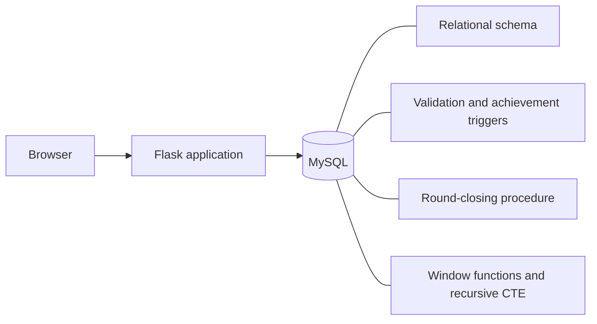
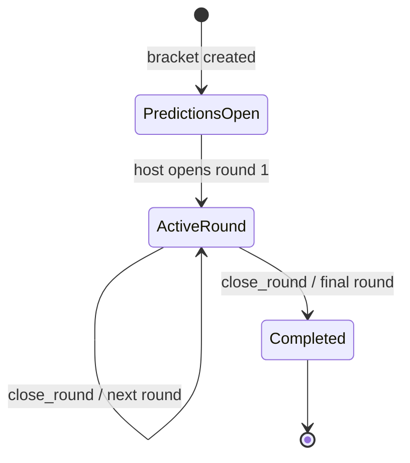
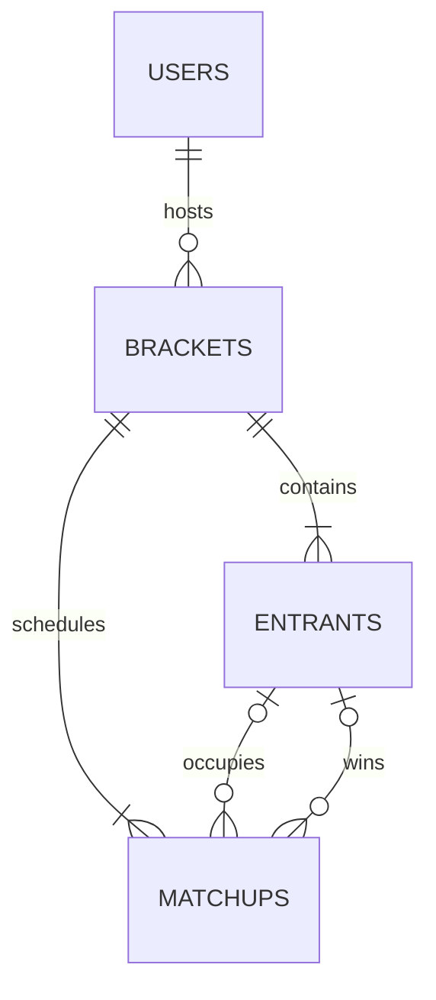
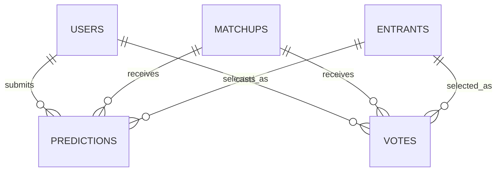
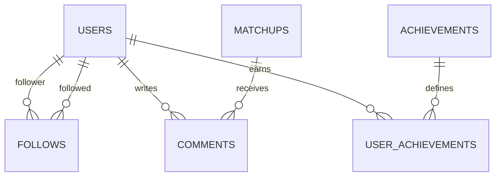

# VERSUS

VERSUS is a web application for running community-voted, single-elimination tournaments. Hosts create brackets of 4, 8, 16, or 32 entrants; users predict the opening round, vote as the tournament progresses, and earn points when their predictions are correct.

Tournament rules are enforced at the data boundary. Flask handles HTTP and sessions; MySQL handles persistence, validation, progression, and ranking.

## Architecture



Application routes coordinate user actions and transactions.

## Tournament lifecycle



1. **Creation.** A host supplies the entrants. The application creates the opening pairings and reserves the required matchup slots for later rounds.
2. **Predictions.** Users select one winner for each opening-round matchup while predictions are open.
3. **Voting.** The host opens the first round. Users may cast one vote per active matchup.
4. **Resolution.** The host closes the round by calling `close_round`. MySQL selects winners from vote totals, advances the better-seeded entrant on a tie, scores predictions, and places winners into their next matchups.
5. **Progression.** The procedure advances the bracket state. Voting and resolution repeat until the final round produces a champion.
6. **Results.** Completed matchups supply the leaderboard, profile statistics, and the champion's round-by-round path.

## Data model

### Tournament structure



`Matchups` are addressed by bracket, round, and slot. Opening-round matchups contain seeded entrants; later matchups begin empty and are populated as winners advance. Foreign keys preserve entity references, and a composite unique constraint allows one matchup per bracket, round, and slot.

### Predictions and votes



Composite unique constraints allow one prediction and one vote per user and matchup. Before-insert triggers restrict predictions to the prediction phase and votes to the bracket's active round.

### Profiles and community



Profiles combine hosted brackets, prediction statistics, followers, and achievements. Comments belong to individual matchups. Achievement triggers award milestones when a user creates a first bracket or submits a tenth prediction.

## Database operations

| Operation | Implementation |
| --- | --- |
| Enforce valid prediction and voting phases | `BEFORE INSERT` triggers |
| Award bracket and prediction milestones | `AFTER INSERT` triggers |
| Resolve and advance a tournament round | `close_round` stored procedure |
| Rank users by prediction score | `RANK`, `DENSE_RANK`, and `PERCENT_RANK` |
| Reconstruct the champion's path | Recursive CTE |
| Preserve entity and relationship integrity | Foreign keys, checks, composite uniqueness, and indexes |

## Technology

- Python 3
- Flask and Flask-Login
- MySQL 8
- Jinja templates

## Local setup

Create the database and install the Python dependencies:

```bash
mysql -u root -p < schema.sql
python3 -m venv .venv
source .venv/bin/activate
pip install -r requirements.txt
cp .env.example .env
```

Set the Flask secret and MySQL credentials in `.env`, then start the server:

```bash
python app.py
```

VERSUS is available at `http://127.0.0.1:5001`.
